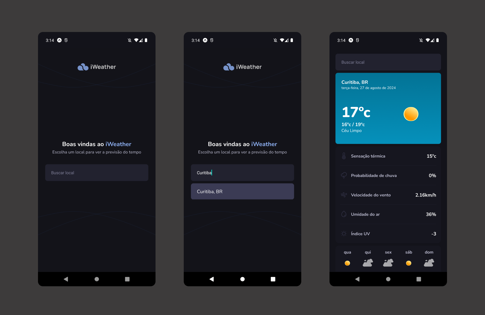

<h1 align="center"> iweather </h1>

  <a href="#-tecnologias">Tecnologias</a>&nbsp;&nbsp;&nbsp;|&nbsp;&nbsp;&nbsp;
  <a href="#-projeto">Projeto</a>&nbsp;&nbsp;&nbsp;|&nbsp;&nbsp;&nbsp;
  <a href="#memo-licença">Licença</a>

  

 

  

## 🚀 Tecnologias

Esse projeto foi desenvolvido com as seguintes tecnologias:

- React Native
- Jest
- Testing Library

## 🔥 Algumas features neste projeto

- Testes de componente e integração com Jest e Testing Library

## 💻 Projeto

- Está é uma aplicação para pesquisar e obter informações de clima e tempo de qualquer lugar do mundo,
  criada com React Native para exercitar o conceitos de testes.

## ✅ Esse projeto foi criado ao longo do curso Ignite React Native da plataforma Rocketseat

## 📝 Licença

Esse projeto está sob a licença MIT.

---
